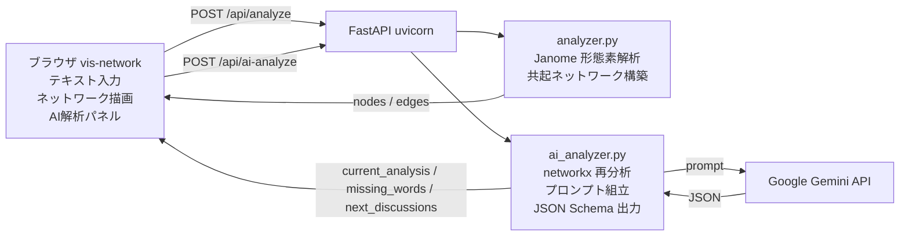

# 共起ネットワーク x AI示唆 デモシステム

会話履歴などの日本語テキストから、キーワードの共起ネットワークを構築してブラウザ上で可視化するデモです。さらに Gemini API による AI 解析機能を備え、議論の中心、欠落観点、次に議論すべきトピックを構造化された形で提示します。

---

## システム概要



---

## ファイル構成と役割

```
.
+-- README.md                    このファイル
+-- Dockerfile                   python:3.12-slim ベース、uvicorn 起動
+-- docker-compose.yml           ポート公開と .env 注入
+-- .dockerignore                ビルドコンテキスト除外（.env, __pycache__ 等）
+-- .gitignore                   Git 追跡除外（.env など）
+-- .env.sample                  環境変数テンプレート（コミット可）
+-- .env                         実際のAPIキーを書く（git/docker双方で除外）
|
+-- backend/
|   +-- main.py                  FastAPI エンドポイント定義 + 静的配信
|   |                              POST /api/analyze     共起ネットワーク生成
|   |                              POST /api/ai-analyze  Gemini による示唆生成
|   +-- analyzer.py              共起ネットワーク構築ロジック
|   |                              - 文分割／名詞抽出（Janome）
|   |                              - ストップワード除去
|   |                              - 共起カウントから nodes/edges 生成
|   +-- ai_analyzer.py           AI示唆生成ロジック
|   |                              - networkx で中心性／クラスタ／橋渡し語を再算出
|   |                              - システム/ユーザープロンプト組立
|   |                              - Gemini 呼出 + JSON Schema による構造化出力
|   |                              - 503時のモデルフォールバック
|   +-- requirements.txt         依存パッケージ
|
+-- frontend/
    +-- index.html               左ペイン（入力）+ 右ペイン（ネットワーク + AIパネル）
    +-- style.css                スタイル定義
    +-- app.js                   解析実行・ネットワーク描画・AI解析リクエスト
                                   - 入力変更検知で AI 解析ボタンをグレーアウト
                                   - vis-network による独自レイアウト計算
```

---

## 必要環境

- Docker / Docker Compose
- Gemini API キー（[Google AI Studio](https://aistudio.google.com/apikey) で取得）

---

## 実行方法

### 1. リポジトリを取得

```bash
git clone <repository-url>
cd word-co-occurrence-network-demo-system
```

### 2. 環境変数ファイルを作成

`.env.sample` をコピーして `.env` を作成し、APIキーを記入します。

```bash
cp .env.sample .env
```

`.env` を開き、`xxxxxxxxxxxxxxxxxxxxx` を自分の Gemini API キーに置き換えます。

```env
GEMINI_API_KEY=AIza...your_actual_api_key_here
GEMINI_MODEL=gemini-3-flash-preview
```

任意設定: `GEMINI_FALLBACK_MODELS=gemini-2.5-flash` を追加すると、メインモデルが 503 を返した際の自動フォールバック先を指定できます（デフォルトで `gemini-2.5-flash`）。

### 3. コンテナを起動

```bash
docker compose up -d --build
```

初回はイメージビルドのため数分かかります。

### 4. ブラウザでアクセス

```
http://localhost:8000
```

### 5. 操作

1. 左ペインに解析したい日本語テキストを貼り付け（初期値はサンプル会話）
2. 必要に応じて窓サイズ・最小出現頻度・最小共起頻度を調整
3. 「解析する」で共起ネットワークを描画
4. 「AI解析」で Gemini による示唆を右側パネルに表示
   - 解析実行前および入力変更後はグレーアウトされ押下不可

### 停止 / ログ確認

```bash
docker compose logs -f          # ログ追従
docker compose down             # 停止
docker compose down --rmi local # イメージごと削除
```

---

## API 仕様

### POST /api/analyze

共起ネットワークを生成します。

リクエスト:

```json
{
  "text": "解析対象の日本語テキスト",
  "window_size": 10,
  "min_freq": 2,
  "min_cooc": 2
}
```

レスポンス:

```json
{
  "nodes": [{ "id": "顧客", "label": "顧客", "frequency": 7 }],
  "edges": [{ "source": "顧客", "target": "ターゲット", "weight": 5 }],
  "stats": {
    "sentence_count": 24,
    "valid_sentence_count": 23,
    "unique_term_count": 51,
    "node_count": 20,
    "edge_count": 19
  }
}
```

### POST /api/ai-analyze

ノード／エッジを Gemini に渡して示唆を生成します。

リクエスト:

```json
{
  "nodes": [{ "id": "顧客", "label": "顧客", "frequency": 7 }],
  "edges": [{ "source": "顧客", "target": "ターゲット", "weight": 5 }]
}
```

レスポンス:

```json
{
  "model": "gemini-3-flash-preview",
  "requested_model": "gemini-3-flash-preview",
  "summary": { "stats": {}, "top_keywords": [], "clusters": [] },
  "ai": {
    "current_analysis": "現在の議論の中心テーマと偏りの要約",
    "missing_words": [
      { "category": "競合分析", "keywords": ["競合", "市場"], "reason": "理由" }
    ],
    "next_discussions": [
      { "priority": 1, "topic": "製品コンセプトの明確化", "reason": "理由" }
    ]
  }
}
```

---

## トラブルシューティング

| 症状 | 原因と対処 |
|---|---|
| AI解析で 503 エラー | プレビューモデル（`gemini-3-flash-preview`）が高負荷。フォールバックで `gemini-2.5-flash` に切替えるか、`.env` の `GEMINI_MODEL` を安定モデルに変更 |
| AI解析で 500「GEMINI_API_KEY が設定されていません」 | `.env` 未作成、または `docker compose up` 時にコンテナへ注入されていない。再ビルド `docker compose up -d --build` |
| グラフが空 | 入力テキストが短すぎる、または最小出現頻度／最小共起頻度が高すぎる。値を `1` に下げて再試行 |
| AI解析ボタンが押せない | 「解析する」未実行、または入力変更でグラフが古くなっている。「解析する」を再実行 |

---

## 環境変数一覧

| 変数 | 必須 | デフォルト | 説明 |
|---|---|---|---|
| `GEMINI_API_KEY` | yes | なし | Gemini API キー |
| `GEMINI_MODEL` | no | `gemini-3-flash-preview` | 主モデル名 |
| `GEMINI_FALLBACK_MODELS` | no | `gemini-2.5-flash` | カンマ区切りでフォールバック先を複数指定可 |
